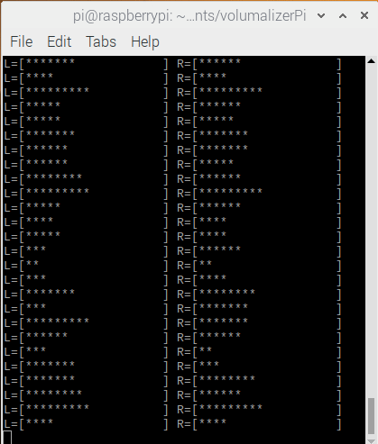

# volumalizerPi
Raspberry pi based music visualizer for 16x2 character display written in python.

## Demo

883ed75f8eee2d9c83091fa2c0cc742a245b17b7

## What you need
* raspberry pi
* 16x2 character display

## Makefile
* `make install_ubuntu` - install dependencies
* `make` - run script

## Info
* update GPIO in `GPIO config` script section
* choose your animation: `animate_horizontal`/`animate_vertical`
* change `CHARACTER`s
* show console logs: `SHOW_CONSOLE`

## Links
* https://pimylifeup.com/raspberry-pi-lcd-16x2/
* https://www.swharden.com/wp/2016-07-19-realtime-audio-visualization-in-python/
